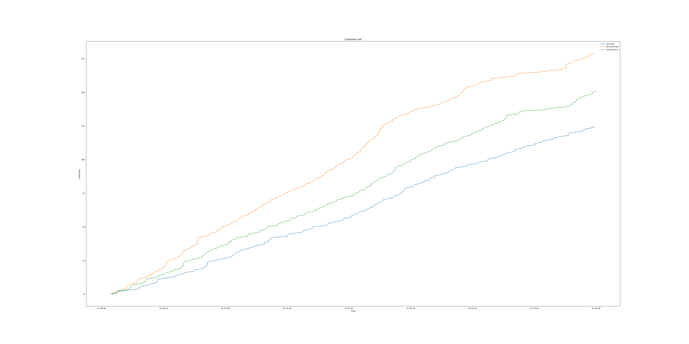
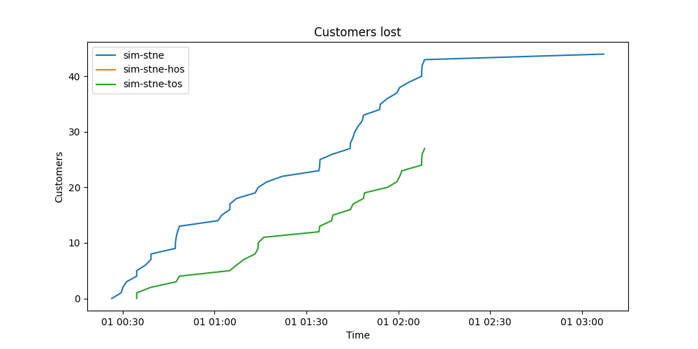
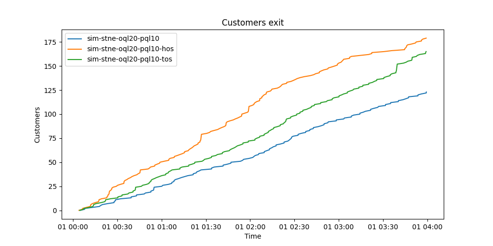
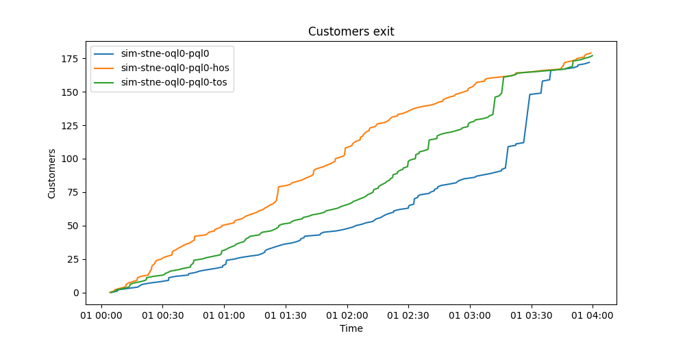
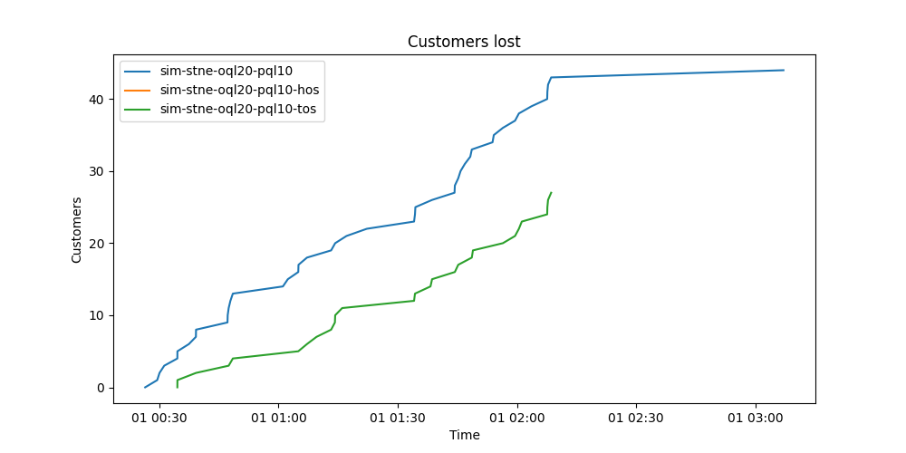

  <h1>Data</h1>
  <table>
  <tr>
    <td></td>
    <td>mcd1</td>
    <td>mcd2</td>
    <td>sim-stne</td>
    <td>sim-stne-hos</td>
    <td>sim-stne-tos</td>
  </tr>
  <tr>
    <td>New Arrival</td>
    <td>
      <table>
        <tr>
          <td>0:00:05</td>
        </tr>
        <tr>
          <td>0:01:28.500000</td>
        </tr>
        <tr>
          <td>0:04:01</td>
        </tr>
      </table>
    </td>
    <td>
      <table>
        <tr>
          <td>0:00:02</td>
        </tr>
        <tr>
          <td>0:01:09.967742</td>
        </tr>
        <tr>
          <td>0:03:38</td>
        </tr>
      </table>
    </td>
    <td>
      <table>
        <tr>
          <td>0:00:01</td>
        </tr>
        <tr>
          <td>0:01:43.708029</td>
        </tr>
        <tr>
          <td>0:09:08</td>
        </tr>
      </table>
    </td>
    <td>
      <table>
        <tr>
          <td>0:00:01</td>
        </tr>
        <tr>
          <td>0:01:18.065934</td>
        </tr>
        <tr>
          <td>0:09:08</td>
        </tr>
      </table>
    </td>
    <td>
      <table>
        <tr>
          <td>0:00:01</td>
        </tr>
        <tr>
          <td>0:01:32.259740</td>
        </tr>
        <tr>
          <td>0:09:08</td>
        </tr>
      </table>
    </td>
  </tr>
  <tr>
    <td>Queue</td>
    <td>
      <table>
        <tr>
          <td>0:00:00</td>
        </tr>
        <tr>
          <td>0:00:12.333333</td>
        </tr>
        <tr>
          <td>0:01:04</td>
        </tr>
      </table>
    </td>
    <td>
      <table>
        <tr>
          <td>0:00:00</td>
        </tr>
        <tr>
          <td>0:01:10.968750</td>
        </tr>
        <tr>
          <td>0:05:46</td>
        </tr>
      </table>
    </td>
    <td>
      <table>
        <tr>
          <td>0:00:00</td>
        </tr>
        <tr>
          <td>0:11:59.409091</td>
        </tr>
        <tr>
          <td>0:23:01</td>
        </tr>
      </table>
    </td>
    <td>
      <table>
        <tr>
          <td>0:00:00</td>
        </tr>
        <tr>
          <td>0:01:23.224044</td>
        </tr>
        <tr>
          <td>0:05:10</td>
        </tr>
      </table>
    </td>
    <td>
      <table>
        <tr>
          <td>0:00:00</td>
        </tr>
        <tr>
          <td>0:07:11.619355</td>
        </tr>
        <tr>
          <td>0:20:02</td>
        </tr>
      </table>
    </td>
  </tr>
  <tr>
    <td>Order</td>
    <td>
      <table>
        <tr>
          <td>0:00:18</td>
        </tr>
        <tr>
          <td>0:00:35.066667</td>
        </tr>
        <tr>
          <td>0:01:23</td>
        </tr>
      </table>
    </td>
    <td>
      <table>
        <tr>
          <td>0:00:10</td>
        </tr>
        <tr>
          <td>0:00:58.500000</td>
        </tr>
        <tr>
          <td>0:02:17</td>
        </tr>
      </table>
    </td>
    <td>
      <table>
        <tr>
          <td>0:00:15</td>
        </tr>
        <tr>
          <td>0:01:46.274809</td>
        </tr>
        <tr>
          <td>0:05:42</td>
        </tr>
      </table>
    </td>
    <td>
      <table>
        <tr>
          <td>0:00:13</td>
        </tr>
        <tr>
          <td>0:00:46.666667</td>
        </tr>
        <tr>
          <td>0:03:00</td>
        </tr>
      </table>
    </td>
    <td>
      <table>
        <tr>
          <td>0:00:14</td>
        </tr>
        <tr>
          <td>0:01:13.006494</td>
        </tr>
        <tr>
          <td>0:04:59</td>
        </tr>
      </table>
    </td>
  </tr>
  <tr>
    <td>Pickup Queue</td>
    <td>
      <table>
        <tr>
          <td>0:00:00</td>
        </tr>
        <tr>
          <td>0:01:19.933333</td>
        </tr>
        <tr>
          <td>0:03:16</td>
        </tr>
      </table>
    </td>
    <td>
      <table>
        <tr>
          <td>0:00:00</td>
        </tr>
        <tr>
          <td>0:00:43.437500</td>
        </tr>
        <tr>
          <td>0:03:27</td>
        </tr>
      </table>
    </td>
    <td>
      <table>
        <tr>
          <td>0:00:00</td>
        </tr>
        <tr>
          <td>0:08:26.078740</td>
        </tr>
        <tr>
          <td>0:15:16</td>
        </tr>
      </table>
    </td>
    <td>
      <table>
        <tr>
          <td>0:00:00</td>
        </tr>
        <tr>
          <td>0:03:18.955801</td>
        </tr>
        <tr>
          <td>0:08:06</td>
        </tr>
      </table>
    </td>
    <td>
      <table>
        <tr>
          <td>0:00:00</td>
        </tr>
        <tr>
          <td>0:05:51.084967</td>
        </tr>
        <tr>
          <td>0:11:20</td>
        </tr>
      </table>
    </td>
  </tr>
  <tr>
    <td>Pickup</td>
    <td>
      <table>
        <tr>
          <td>0:00:08</td>
        </tr>
        <tr>
          <td>0:01:10.466667</td>
        </tr>
        <tr>
          <td>0:03:20</td>
        </tr>
      </table>
    </td>
    <td>
      <table>
        <tr>
          <td>0:00:05</td>
        </tr>
        <tr>
          <td>0:01:06.718750</td>
        </tr>
        <tr>
          <td>0:04:52</td>
        </tr>
      </table>
    </td>
    <td>
      <table>
        <tr>
          <td>0:00:04</td>
        </tr>
        <tr>
          <td>0:01:52.182540</td>
        </tr>
        <tr>
          <td>0:07:28</td>
        </tr>
      </table>
    </td>
    <td>
      <table>
        <tr>
          <td>0:00:05</td>
        </tr>
        <tr>
          <td>0:01:05.894444</td>
        </tr>
        <tr>
          <td>0:03:52</td>
        </tr>
      </table>
    </td>
    <td>
      <table>
        <tr>
          <td>0:00:05</td>
        </tr>
        <tr>
          <td>0:01:27.875000</td>
        </tr>
        <tr>
          <td>0:05:31</td>
        </tr>
      </table>
    </td>
  </tr>
  <tr>
    <td>Sales Volume</td>
          <td>--</td>
          <td>--</td>
          <td>3201.31</td>
          <td>1837.5</td>
          <td>2522.76</td>
  </tr>
  <tr>
    <td>Customers Lost</td>
          <td>--</td>
          <td>--</td>
          <td>45</td>
          <td>0</td>
          <td>28</td>
  </tr>
  <tr>
    <td>Sales Volume Lost</td>
          <td>--</td>
          <td>--</td>
          <td>0</td>
          <td>0</td>
          <td>0</td>
  </tr>
  </table>
    
  <table>
    <tr>
      <td>Legend</td>
      <td>
        <table>
          <tr>
            <td>Min</td>
          </tr>
          <tr>
            <td>Avg</td>
          </tr>
          <tr>
            <td>Max</td>
          </tr>
        </table>
      </td>
    </tr>
  </table>
  
  <h1>Graphs</h1>
  
  
  
  
  
  